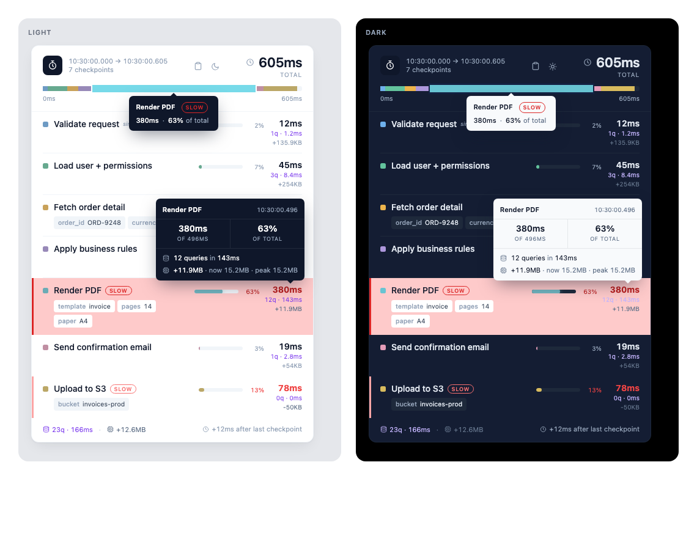

# Stopwatch for PHP & Laravel

Easily profile of parts of your application/code and measure the performance to expose the bottlenecks

## Installation

You can install the package via composer:

```bash
composer require sandermuller/stopwatch
```

## Usage

### Start the stopwatch

```php
use SanderMuller\Stopwatch\Stopwatch;

$stopwatch = Stopwatch::start();
```

### Add a lap/checkpoint

```php
use SanderMuller\Stopwatch\Stopwatch;

$stopwatch = Stopwatch::start();

$stopwatch->checkpoint('First checkpoint');
// Or
$stopwatch->lap('Second checkpoint');
```

### Get the total run duration

```php
use SanderMuller\Stopwatch\Stopwatch;

$stopwatch = Stopwatch::start();

// Do something

echo $stopwatch->toString();
// or
echo (string) $stopwatch;
// Echoes something like: 116ms
```

### Render as HTML

Render a neat HTML output showing the total execution time, each checkpoint and the time between each checkpoint.

The checkpoints that took up most of the time will be highlighted.

```php
use SanderMuller\Stopwatch\Stopwatch;

$stopwatch = Stopwatch::start();

// Do something

$stopwatch->checkpoint('First checkpoint');

// Do something more

$stopwatch->checkpoint('Second checkpoint');

echo $stopwatch->toHtml();
// Or in Laravel
{{ $stopwatch }}
```



### Manually stop the stopwatch

You can manually stop the stopwatch, but it will also stop automatically when the Stopwatch output is used (e.g. when you echo the Stopwatch object or call `->totalRunDuration()`).

```php
use SanderMuller\Stopwatch\Stopwatch;

$stopwatch = Stopwatch::start();

// Do something

$stopwatch->stop();

// Do something you don't want to measure

// Finally render the output
echo $stopwatch->toHtml();
```
