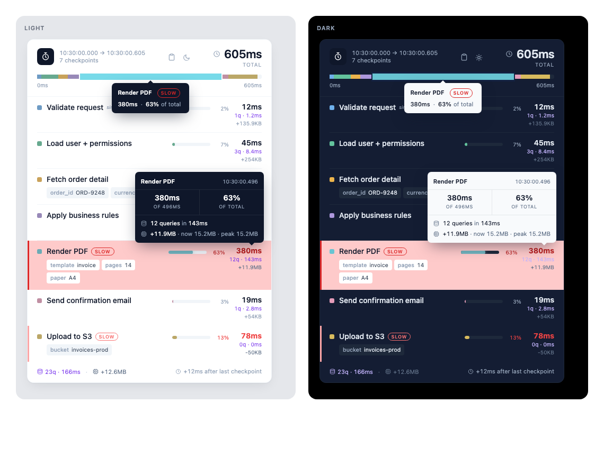

# Stopwatch for PHP & Laravel

[](https://packagist.org/packages/sandermuller/stopwatch)
[](https://github.com/sandermuller/stopwatch/actions/workflows/run-tests.yml)
[](https://github.com/sandermuller/stopwatch/actions?query=workflow%3Aphpstan+branch%3Amain)
[](https://packagist.org/packages/sandermuller/stopwatch)
[](LICENSE)
[](https://packagist.org/packages/sandermuller/stopwatch)

A lightweight profiler for PHP and Laravel. Add checkpoints to your code, measure closures, track queries and memory, and see where time is spent. Output as HTML, Server-Timing headers, log entries, or Debugbar timelines.

**Requires PHP 8.3+**

## Installation

You can install the package via composer:

```bash
composer require sandermuller/stopwatch
```

Optionally publish the config file:

```bash
php artisan vendor:publish --tag=stopwatch-config
```

## Configuration

All settings can be configured via environment variables or the `config/stopwatch.php` file:

| Setting            | Env Variable                 | Default  | Description                                              |
|--------------------|------------------------------|----------|----------------------------------------------------------|
| `enabled`          | `STOPWATCH_ENABLED`          | `true`   | Disable to make all calls no-ops with near-zero overhead |
| `output`           | `STOPWATCH_OUTPUT`           | `silent` | Default output mode (`silent`, `log`, `stderr`, `dump`)  |
| `log_level`        | `STOPWATCH_LOG_LEVEL`        | `debug`  | Log level when output is `log`                           |
| `slow_threshold`   | `STOPWATCH_SLOW_THRESHOLD`   | `50`     | Highlight checkpoints slower than this (ms)              |
| `track_queries`    | `STOPWATCH_TRACK_QUERIES`    | `false`  | Auto-track query count and duration per checkpoint       |
| `track_memory`     | `STOPWATCH_TRACK_MEMORY`     | `false`  | Auto-track memory usage per checkpoint                   |
| `track_http`       | `STOPWATCH_TRACK_HTTP`       | `false`  | Auto-track outbound `Http::` calls per checkpoint        |
| `notify_threshold` | `STOPWATCH_NOTIFY_THRESHOLD` | `null`   | Notify via channels if total duration exceeds this (ms)  |
| `mail.to`          | `STOPWATCH_MAIL_TO`          | `null`   | Recipient address for `MailChannel` notifications        |
| `mail.subject`     | `STOPWATCH_MAIL_SUBJECT`     | `null`   | Email subject (defaults to duration if not set)          |

## Usage

### Checkpoints

```php
stopwatch()->checkpoint('First checkpoint');
stopwatch()->checkpoint('Second checkpoint');
stopwatch()->lap('Third checkpoint'); // alias for checkpoint()
```

Calling `checkpoint()` auto-starts the stopwatch if it hasn't been started yet. You can also start it explicitly with `stopwatch()->start()`. Note that `start()` resets any existing checkpoints, use it to begin a fresh measurement.

You can attach metadata to any checkpoint:

```php
stopwatch()->checkpoint('Query executed', ['table' => 'users', 'rows' => 42]);
```

### Output each checkpoint

Configure where each checkpoint is emitted using `outputTo()`:

```php
use SanderMuller\Stopwatch\StopwatchOutput;

stopwatch()->outputTo(StopwatchOutput::Log)->start();

stopwatch()->checkpoint('First checkpoint');  // Automatically logged
stopwatch()->checkpoint('Second checkpoint'); // Automatically logged
```

Available output modes:

| Mode                      | Description                          |
|---------------------------|--------------------------------------|
| `StopwatchOutput::Silent` | Collect only, render later (default) |
| `StopwatchOutput::Log`    | Send to Laravel log                  |
| `StopwatchOutput::Stderr` | Write to stderr                      |
| `StopwatchOutput::Dump`   | Use Laravel's `dump()`               |

You can override the output for a single checkpoint:

```php
stopwatch()->checkpoint('Debug this', output: StopwatchOutput::Dump);
```

Or use the `log()` shortcut to send a single checkpoint to the log:

```php
stopwatch()->log('Query executed');
stopwatch()->log('Query executed', level: 'warning');
```

### Measure a closure

Wrap a closure to automatically create a checkpoint after execution. Auto-starts the stopwatch if needed.

```php
$result = stopwatch()->measure('Heavy computation', function () {
    return doExpensiveWork();
});
```

### Query tracking

Automatically track the number of database queries and their total duration between each checkpoint. Requires `illuminate/database`.

```php
stopwatch()->withQueryTracking()->start();

User::all();
stopwatch()->checkpoint('Load users');
// Checkpoint includes: 1q / 2.3ms

Order::where('status', 'pending')->get();
stopwatch()->checkpoint('Load orders');
// Checkpoint includes: 1q / 1.5ms
```

Can also be enabled via config (`STOPWATCH_TRACK_QUERIES=true`). Up to 50 SQL statements + bindings + per-query duration are stored per checkpoint and shown when you click a row to expand its detail modal — handy when you need to inspect *which* query was slow, not just the count.

### Memory tracking

Track memory usage changes between each checkpoint:

```php
stopwatch()->withMemoryTracking()->start();

$data = loadLargeDataset();
stopwatch()->checkpoint('Load data');
// Checkpoint includes: +2.4MB
```

In the HTML output, memory is shown as a compact delta badge with full details on hover (current usage, delta, peak). In plain-text output (`toStderr`, `toLog`), the delta is included inline. Can also be enabled via config (`STOPWATCH_TRACK_MEMORY=true`).

### HTTP tracking

Track outbound HTTP requests sent through Laravel's `Http::` facade between each checkpoint. Per-checkpoint count + total time appear as a chip; the hover tooltip shows the first three calls (method · URL · status · duration) with an `+N more` line if there were more, plus a footer total across the whole profile.

```php
stopwatch()->withHttpTracking()->start();

Http::get('https://api.example.com/users');
Http::post('https://api.example.com/orders', $payload);
stopwatch()->checkpoint('Sync order');
// Checkpoint includes: 2h / 156ms
```

Status codes are color-coded in the tooltip (green 2xx, amber 4xx, red 5xx + connection failures). Up to 50 call detail rows are stored per checkpoint to bound memory; the count + total time still reflect every call beyond that. Can also be enabled via config (`STOPWATCH_TRACK_HTTP=true`).

**Limitation:** only requests through Laravel's `Http::` facade are captured. Direct `new GuzzleHttp\Client` instances bypass Laravel's event dispatcher and won't be tracked — same limitation as Laravel Telescope. If you need direct-Guzzle tracking, wrap calls in `stopwatch()->measure()` manually.

All tracking methods can be combined:

```php
stopwatch()->withQueryTracking()->withMemoryTracking()->withHttpTracking()->start();
```

Use `when()` / `unless()` to toggle parts of the chain conditionally without breaking the fluent flow:

```php
stopwatch()
    ->withMemoryTracking()
    ->when($trackQueries, fn ($sw) => $sw->withQueryTracking())
    ->unless(app()->runningUnitTests(), fn ($sw) => $sw->withHttpTracking())
    ->start();
```

### Write a full report

Write all checkpoints and the total duration to stderr or your log:

```php
stopwatch()->checkpoint('Validation');
stopwatch()->checkpoint('DB inserts');

// Write to stderr
stopwatch()->toStderr('Profile:');

// Or write to the log
stopwatch()->toLog('Profile:', level: 'info');
```

### Conditional notifications

Get notified when a request or operation exceeds a time threshold. Notifications are dispatched when the stopwatch finishes:

```php
stopwatch()->notifyIfSlowerThan(500);

stopwatch()->checkpoint('Fetch order');
stopwatch()->checkpoint('Generate PDF');
stopwatch()->checkpoint('Upload to S3');

stopwatch()->finish(); // notifications dispatch here if total >= 500ms
```

The threshold is also checked on implicit finishes (`render()`, `toArray()`, `toLog()`, `toStderr()`), and also accepts `CarbonInterval`:

```php
stopwatch()->notifyIfSlowerThan(CarbonInterval::seconds(2));
```

The threshold and channels can be configured entirely via config/env:

```env
STOPWATCH_NOTIFY_THRESHOLD=500
```

This pairs well with the middleware. Every request that exceeds the threshold will trigger a notification automatically.

Or set it programmatically in a service provider:

```php
// AppServiceProvider::boot()
stopwatch()->notifyIfSlowerThan(500);
```

Configure which channels are used in `config/stopwatch.php`:

```php
'notification_channels' => [
    \SanderMuller\Stopwatch\Notifications\LogChannel::class,
],
```

#### Email notifications

Add `MailChannel` to receive an email with the stopwatch's HTML report when a threshold is exceeded:

```php
'notification_channels' => [
    \SanderMuller\Stopwatch\Notifications\LogChannel::class,
    \SanderMuller\Stopwatch\Notifications\MailChannel::class,
],
```

Configure the recipient in your `.env`:

```env
STOPWATCH_MAIL_TO=dev-team@example.com
STOPWATCH_MAIL_SUBJECT="Slow request detected"  # optional
```

Or bind the channel with constructor arguments:

```php
$this->app->bind(MailChannel::class, fn () => new MailChannel(
    to: 'dev-team@example.com',
    subject: 'Slow request',
));
```

#### Custom notification channels

Create your own channel by implementing `StopwatchNotificationChannel`:

```php
use SanderMuller\Stopwatch\Notifications\StopwatchNotificationChannel;
use SanderMuller\Stopwatch\Stopwatch;

class SlackChannel implements StopwatchNotificationChannel
{
    public function notify(Stopwatch $stopwatch): void
    {
        Slack::message("Slow request: {$stopwatch->totalRunDurationReadable()}");
    }
}
```

Register it in your config:

```php
'notification_channels' => [
    \SanderMuller\Stopwatch\Notifications\LogChannel::class,
    \App\Stopwatch\SlackChannel::class,
],
```

Or set channels at runtime:

```php
stopwatch()->notifyUsing([new SlackChannel()]);
```

### Render as HTML

Render an HTML report with the total execution time, each checkpoint, and the time between them. Slow checkpoints are highlighted.

```php
stopwatch()->checkpoint('First checkpoint');
stopwatch()->checkpoint('Second checkpoint');

// Render the output
{{ stopwatch()->render() }}
```

Or use the Blade directive:

```blade
@stopwatch
```



The card is self-contained — all styles are inline so it drops into any host page (or email body) without picking up surrounding CSS. It includes:

- **Smart duration formatting** that scales the unit so long profiles read clearly: `3.4ms`, `143ms`, `1.25s`, `1m 5s`. Available as a public helper too: `Stopwatch::formatDuration(1247)`.
- **Slow severity tiers.** Checkpoints over the slow threshold get a tiered red signal — light (1×–2×), medium (2×–5×), heavy (5×+) — so you can tell a barely-slow row from a way-too-slow one at a glance.
- **Overview bar** at the top with one colored segment per checkpoint, sized by share of total. Hovering a row cross-highlights its segment, and vice versa.
- **Hover tooltip** per row with the full label, timestamp, delta vs cumulative, share, query and memory metrics.
- **Click any row to expand** into a centered modal showing the full label, all metadata, memory current/delta/peak, every captured query (with SQL + bindings + per-query duration), and every captured HTTP call (method/URL/status/duration). Backdrop click, ESC, or × button closes; only one row open at a time.
- **Footer totals** showing the cumulative query count, query time, HTTP count, HTTP time, and memory delta when the corresponding tracking is enabled.
- **Copy as Markdown** button (clipboard icon, header) that copies a Markdown summary table to the clipboard — paste it into a chat with an AI assistant or a bug report. Available programmatically too: `stopwatch()->toMarkdown()`.
- **Empty state** when no checkpoints have been recorded.

#### Light + dark mode

The card respects `prefers-color-scheme` automatically, and includes a built-in toggle button (sun/moon, in the header) that lets users override the theme. The choice persists in `localStorage` under the `sw-theme` key. Pages that disallow JavaScript fall back to the system preference and the toggle is hidden.

#### Custom CSS overrides

The card root is `.sw-stopwatch`. All themable surfaces are exposed as CSS variables (e.g. `--sw-bg`, `--sw-text`, `--sw-border`, `--sw-hover-bg`, `--sw-tip-bg`). To re-skin without forking the renderer, override these on `.sw-stopwatch` (or its `[data-theme="dark"]` variant) in your application stylesheet.

#### Print

A `@media print` rule strips shadows, drops the toggle button and tooltips, expands the card to full width, and disables the bar grow-in animation, so PDF exports of an HTML profile look clean.

### Laravel Debugbar

If you have [barryvdh/laravel-debugbar](https://github.com/barryvdh/laravel-debugbar) installed, checkpoint timings automatically appear as a timeline tab in Debugbar with a duration badge.

### Server-Timing header

Add a `Server-Timing` HTTP header to your responses so you can inspect checkpoint timings in the browser's DevTools Network tab.

Register the middleware to automatically add the header whenever the stopwatch has been started:

```php
// bootstrap/app.php
use SanderMuller\Stopwatch\StopwatchMiddleware;

return Application::configure(basePath: dirname(__DIR__))
    ->withMiddleware(function (Middleware $middleware) {
        $middleware->append(StopwatchMiddleware::class);
    })
    // ...
```

By default the middleware is passive, it only adds the `Server-Timing` header if the stopwatch was started somewhere in your code (e.g. via `stopwatch()->start()` or `stopwatch()->checkpoint()`). Requests where the stopwatch is never started will not have the header.

To auto-start the stopwatch on every request, use `StopwatchMiddleware::autoStart()`:

```php
$middleware->append(StopwatchMiddleware::autoStart());
```

Or add the header manually without the middleware:

```php
return response('OK')
    ->header('Server-Timing', stopwatch()->toServerTiming());
```

### Run log (persistent profile history)

Every finished stopwatch run is written to `storage/stopwatch/runs/<ULID>.md` so you (or an AI assistant) can come back to slow runs later, without re-reproducing them. Crashed requests are captured too, with an `## Exception` section and a stack trace.

#### Enabling the run log

One env var. Off by default.

```dotenv
STOPWATCH_LOG_RUNS=true
```

Pair with `StopwatchMiddleware` for HTTP runs, or call `stopwatch()->finish()` yourself from a command or job. Runs faster than `STOPWATCH_LOG_MIN_DURATION_MS` (default `50ms`) are skipped.

Each file's body starts with the same markdown `stopwatch()->toMarkdown()` already produces, then appends extra sections when relevant: `## SQL detail` and `## HTTP detail` in `full` mode, `## Exception` when something threw, and `## Context` when the Context collector is enabled. YAML frontmatter on top keeps listing cheap.

#### Inspect runs

Three artisan commands. The full markdown of `show` is what an AI assistant or a human reads to debug.

```bash
php artisan stopwatch:runs:list --slow --limit=10
php artisan stopwatch:runs:show <id>
php artisan stopwatch:runs:clear              # cleanup when done
```

Filter the list:

```bash
php artisan stopwatch:runs:list --threw                          # only crashed runs
php artisan stopwatch:runs:list --exception-class=ValidationException
php artisan stopwatch:runs:list --ctx tenant_id=acme --ctx user_id=42
php artisan stopwatch:runs:list --format=json                    # for scripts / jq
```

Want a predictable cron job instead of the 5%-probabilistic in-process prune?

```bash
0 3 * * * php artisan stopwatch:runs:clear --days=7 --force
0 3 * * * php artisan stopwatch:runs:clear --keep=200 --force
```

#### Let your AI read the logs

If you have [`laravel/boost`](https://github.com/laravel/boost) installed and the bundled `profile-app` skill synced to your editor, you can skip the artisan commands and just ask. Something like *"the /admin/users page feels slow, can you figure out why?"* is enough. The skill will:

1. Verify `STOPWATCH_LOG_RUNS=true` and turn it on if not.
2. Ask you to reproduce the slow request.
3. Run `stopwatch:runs:list --slow` and pick the worst offenders.
4. Run `stopwatch:runs:show <id>` on each, read the per-checkpoint table, and point at the segment that owns most of the share.

Same loop a human would run, just automated. Works with any agent that supports Laravel Boost (Claude Code, Cursor, Copilot, etc.).

#### Workflow: debug a slow request

If you'd rather drive it yourself, here's the loop:

1. Set `STOPWATCH_LOG_RUNS=true` in `.env`. For HTTP requests, register `StopwatchMiddleware::autoStart()` so each run is started and finished automatically. For commands and jobs, call `stopwatch()->start()` at the top of your handler and `stopwatch()->finish()` before it returns. Add `stopwatch()->checkpoint(...)` calls along the suspect path so you can see where time is going, not just that it's slow.
2. Reproduce the slow path. Visit the page, run the command, replay the request — whatever it takes.
3. List the slowest recent runs:
    ```bash
    php artisan stopwatch:runs:list --slow --limit=10
    ```
4. Pick the worst offender's id from the table and inspect it:
    ```bash
    php artisan stopwatch:runs:show 01HZ8K9X4N5P2Q3R4S5T6U7V8W
    ```
5. Read the per-checkpoint table. Find the row that owns most of the **Share** column. Common shapes:
   - High `q` count on one row: N+1 candidate. Flip to `STOPWATCH_LOG_DETAIL=full` and reproduce again to see the actual SQL.
   - High `h` count: outbound API loop. Same flag adds method/URL/status per call.
   - `queries_total` >> sum of per-checkpoint queries: significant work happens after the last checkpoint. Add a checkpoint near the response return and re-profile.
6. Split the hot row by dropping more `stopwatch()->checkpoint(...)` calls inside that section of code. Fix what you find. Go back to step 2.

#### Crash diagnostics

When a request throws, the middleware catches it, persists a run-log file with `threw: true`, then re-throws. Frontmatter gets the exception class / file / line; the body gets a `## Exception` section with a top-N stack trace and (one level of) `### Previous` for wrapped exceptions.

```yaml
---
id: 01HZ8K9X4N5P2Q3R4S5T6U7V8W
url: /admin/users
threw: true
exception_class: Illuminate\Validation\ValidationException
exception_file: app/Http/Controllers/OrderController.php
exception_line: 142
ctx_trace_id: 01HZULID0000000000000000A
---
```

> [!NOTE]
> Trace `args` are **never** persisted. Only `file`, `line`, `class`, `function`, `type` from each frame. The exception message itself is also off by default (set `STOPWATCH_LOG_EXCEPTIONS_MESSAGE=true` to opt in; many app messages quote validation or user input). When enabled, messages are capped via `mb_substr` and can be redacted via `options.exceptions.mask_message_matching`.

For queued jobs / commands that catch their own exceptions, capture them yourself before `finish()`:

```php
use SanderMuller\Stopwatch\Stopwatch;
use Throwable;

try {
    // ...
} catch (Throwable $e) {
    stopwatch()
        ->withTransientContext(Stopwatch::TRANSIENT_EXCEPTION, $e)
        ->finish();

    throw $e;
}
```

#### Correlate with `laravel.log`

Set `STOPWATCH_LOG_COLLECT_CONTEXT=true` to capture `Illuminate\Support\Facades\Context::all()` (Laravel 11+) into a `## Context` body section. Hidden context (`Context::addHidden()`) is **never** read.

If your app already does:

```php
Context::add('trace_id', (string) Str::ulid());
Context::add('tenant_id', $tenant->slug);
```

…promote those keys via `config/stopwatch.php` so they land in frontmatter and `stopwatch:runs:list --ctx key=value` can filter on them:

```php
// config/stopwatch.php → run_log.options.context
'options' => [
    'context' => [
        'frontmatter_keys' => ['trace_id', 'tenant_id'],
    ],
],
```

Promoted scalar values land in frontmatter as `ctx_trace_id` / `ctx_tenant_id`, round-trip-safe (string `"01"` stays `"01"`, not int `1`). Then pivot from run log to log line:

```bash
# Slowest crashed runs of one exception type for one tenant; pull their trace ids
TRACE_IDS=$(php artisan stopwatch:runs:list --threw --exception-class=ValidationException \
    --ctx tenant_id=acme --format=json | jq -r '.[].frontmatter.ctx_trace_id')

# Then grep laravel.log for any of them (Laravel auto-includes Context in structured logs)
for id in $TRACE_IDS; do grep "$id" storage/logs/laravel.log; done
```

#### Configuration

Env knobs (`config/stopwatch.php` under `run_log` for the array-typed ones):

| Var                                          | Default                  | Purpose                                                              |
|----------------------------------------------|--------------------------|----------------------------------------------------------------------|
| `STOPWATCH_LOG_RUNS`                         | `false`                  | Master toggle                                                        |
| `STOPWATCH_LOG_DIR`                          | `storage/stopwatch/runs` | Override the storage path                                            |
| `STOPWATCH_LOG_MIN_DURATION_MS`              | `50`                     | Skip runs faster than this; `0` to log everything                    |
| `STOPWATCH_LOG_MAX_FILES`                    | `200`                    | Cap on retained files (oldest pruned automatically)                  |
| `STOPWATCH_LOG_MAX_AGE_DAYS`                 | `7`                      | Soft age cap (probabilistic prune)                                   |
| `STOPWATCH_LOG_DETAIL`                       | `summary`                | `full` appends per-call SQL/HTTP detail tables                       |
| `STOPWATCH_LOG_INCLUDE_BINDINGS`             | `false`                  | Persist SQL bindings in `full` mode (PII opt-in)                     |
| `STOPWATCH_LOG_SKIP_EMPTY`                   | `true`                   | Skip runs that finished with zero checkpoints                        |
| `STOPWATCH_LOG_COLLECT_EXCEPTIONS`           | `true`                   | Capture `Throwable` class/file/line + trace                          |
| `STOPWATCH_LOG_EXCEPTIONS_MESSAGE`           | `false`                  | Persist `$e->getMessage()` (PII opt-in)                              |
| `STOPWATCH_LOG_EXCEPTIONS_MESSAGE_MAX_CHARS` | `500`                    | Codepoint cap before `…` is appended                                 |
| `STOPWATCH_LOG_EXCEPTIONS_TRACE_FRAMES`      | `10`                     | Trace frame cap (`0` omits the trace section)                        |
| `STOPWATCH_LOG_COLLECT_CONTEXT`              | `false`                  | Capture `Context::all()` (visible only)                              |
| `STOPWATCH_LOG_CONTEXT_VALUE_MAX_BYTES`      | `4096`                   | Per-value byte cap for context body cells                            |

Array-typed options (config-only; env can't express arrays cleanly):

| Config path                                  | Purpose                                                                                            |
|----------------------------------------------|----------------------------------------------------------------------------------------------------|
| `options.exceptions.mask_message_matching`   | Patterns. Leading `/` = preg, otherwise substring; matches replaced with `***`. Applied AFTER cap. |
| `options.exceptions.trace_exclude_paths`     | Substring matches against frame.file. Use to hide vendor noise.                                    |
| `options.context.allow`                      | Allowlist. Empty = all visible **scalar** keys; rich objects need explicit allowlisting.           |
| `options.context.deny`                       | Denylist applied after allow.                                                                      |
| `options.context.mask`                       | Replace value with `***` while preserving the key.                                                 |
| `options.context.frontmatter_keys`           | Promote scalar values to frontmatter as `ctx_<key>` (sortable from list view).                     |

#### Limitations

> [!NOTE]
> The run log is **Laravel-only** and **not supported under Laravel Octane or Swoole**. The `Stopwatch` singleton keeps per-run state in memory, which is not safe for concurrent coroutines. Making the lifecycle per-request is a separate refactor. Until that lands, keep `STOPWATCH_LOG_RUNS=false` under Octane.

> [!NOTE]
> `Stopwatch::dd($exception)` does **not** capture the exception in this version. `dd()` calls `finish()` before it inspects its dump arguments, so the recorder runs first and the throwable never reaches it. Workaround: `$stopwatch->withTransientContext(Stopwatch::TRANSIENT_EXCEPTION, $e)->dd()`.

Run-log writes never throw. Disk failures are logged via `logger()->warning()` and the request completes normally. Crashed runs do a bit of extra work (build the trace, render the `## Exception` section), but the overhead is bounded by `STOPWATCH_LOG_EXCEPTIONS_TRACE_FRAMES` and amortised across the file write.

### Manually stop the stopwatch

You can manually stop the stopwatch to freeze the timing. It will also stop automatically when output is rendered (e.g. `render()`, `toArray()`, `toStderr()`).

```php
stopwatch()->checkpoint('First checkpoint');

// Stop the stopwatch
stopwatch()->stop();

// Do something else you don't want to measure

// Finally render the output
{{ stopwatch()->render() }}
```

You can get the total duration as a string with `stopwatch()->toString()` (e.g. `"116ms"`).

### Enable / disable at runtime

Enable or disable the stopwatch at runtime. When disabled, all calls become no-ops:

```php
stopwatch()->disable();

stopwatch()->checkpoint('Skipped'); // no-op

stopwatch()->enable();
```

### Serialization

Convert the stopwatch data to an array or JSON:

```php
$data = stopwatch()->toArray();
$json = stopwatch()->toJson();
```

### Debugging

```php
stopwatch()->dump(); // dump the stopwatch instance
stopwatch()->dd();   // dump and die
```

### Without Laravel

You can use the stopwatch without the Laravel helper by creating instances directly:

```php
$stopwatch = \SanderMuller\Stopwatch\Stopwatch::new();
$stopwatch->start();
$stopwatch->checkpoint('Done');
echo $stopwatch->toString();
```

The `stopwatch()` helper is not available outside Laravel. Query tracking requires `illuminate/database` and a Laravel application. Config-based setup and notification channel resolution from class strings also require the Laravel container.

## AI assistant skill

This package ships an AI [skill](https://docs.claude.com/en/docs/claude-code/skills) that teaches an AI assistant how and when to reach for `stopwatch()` to investigate a slow request, command, or code path: checkpoint placement, when to enable query / memory / HTTP tracking, how to read the rendered card, and how to wire production tripwires.

If you use [laravel/boost](https://github.com/laravel/boost), the skill is auto-discovered from `vendor/sandermuller/stopwatch/resources/boost/skills/`, just run `php artisan boost:install`.

## License

MIT
