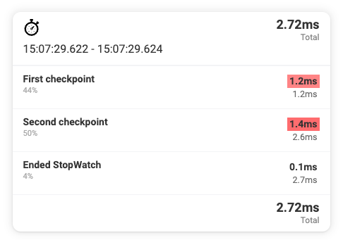

# Stopwatch for PHP & Laravel

Easily profile of parts of your application/code and measure the performance to expose the bottlenecks

## Installation

You can install the package via composer:

```bash
composer require sandermuller/stopwatch
```

## Usage

### Start the stopwatch

```php
stopwatch()->start();
```

### Add a lap/checkpoint

```php
stopwatch()->start();

stopwatch()->checkpoint('First checkpoint');
// Or
stopwatch()->lap('Second checkpoint');
```

### Send the timing directly to your log file

```php
stopwatch()->start();

stopwatch()->log('Second checkpoint');
```

### Display the total run duration

```php
stopwatch()->start();

// Do something

echo stopwatch()->toString();
// Echoes something like: 116ms
```

### Render as HTML

Render a neat HTML output showing the total execution time, each checkpoint and the time between each checkpoint.

The checkpoints that took up most of the time will be highlighted.

```php
stopwatch()->start();

// Do something
stopwatch()->checkpoint('First checkpoint');

// Do something more
stopwatch()->checkpoint('Second checkpoint');

// Render the output
{{ stopwatch()->render() }}
```



### Manually stop the stopwatch

You can manually stop the stopwatch, but it will also stop automatically when the Stopwatch output is used (e.g. when you echo the Stopwatch object or call `->totalRunDuration()`).

```php
stopwatch()->start();

// Do something
stopwatch()->checkpoint('First checkpoint');

// Stop the stopwatch
stopwatch()->stop();

// Do something else you don't want to measure

// Finally render the output
{{ stopwatch()->render() }}
```
