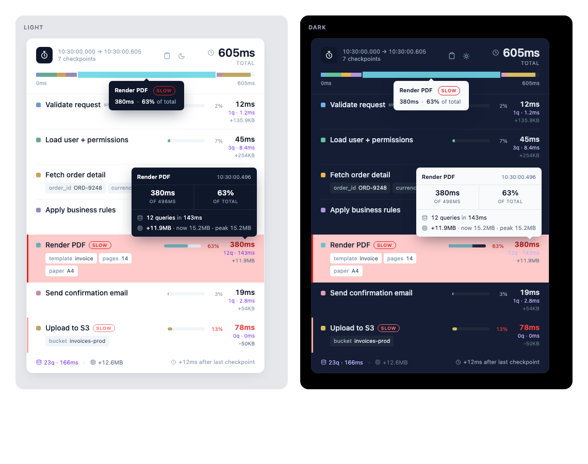

# HTML report

```php
stopwatch()->checkpoint('First checkpoint');
stopwatch()->checkpoint('Second checkpoint');

{{ stopwatch()->render() }}
```

Or the Blade directive:

```blade
@stopwatch
```



Every style is inline, so the card drops into any host page or email body without picking up surrounding CSS.

## What the card shows

- **Duration formatting** that scales the unit: `3.4ms`, `143ms`, `1.25s`, `1m 5s`. Also public: `Stopwatch::formatDuration(1247)`.
- **Slow severity tiers.** Light (1–2×), medium (2–5×), heavy (5×+) past `slow_threshold`, so a barely-slow row reads differently from a hopeless one.
- **Overview bar** with one segment per checkpoint, sized by share. Hovering a row cross-highlights its segment.
- **Row tooltip** with the full label, timestamp, delta, share, and query and memory metrics.
- **Click a row** for a modal with all metadata, memory current/delta/peak, every captured query (SQL, bindings, duration), and every HTTP call.
- **Footer totals** for query count and time, HTTP count and time, and memory delta.
- **Copy as Markdown** in the header, for pasting into a chat or a bug report. Also `stopwatch()->toMarkdown()`.

## Theming

The card follows `prefers-color-scheme` and carries a toggle that persists in `localStorage` under `sw-theme`. Without JavaScript it falls back to the system preference and hides the toggle.

To re-skin it, override the CSS variables on `.sw-stopwatch` (or its `[data-theme="dark"]` variant): `--sw-bg`, `--sw-text`, `--sw-border`, `--sw-hover-bg`, `--sw-tip-bg`.

A `@media print` rule drops shadows, tooltips and the toggle and expands the card to full width, so a PDF export reads cleanly.
